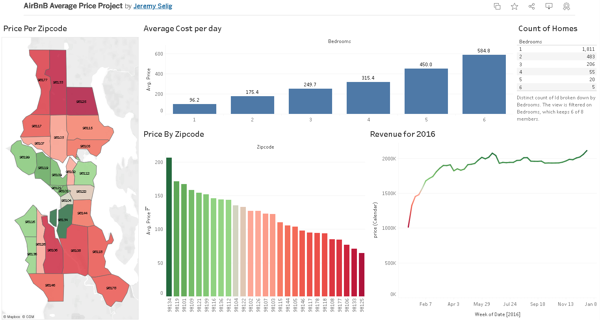

# Airbnb Average Price Dashboard

🔗 [View Dashboard](https://public.tableau.com/views/AirBnBAveragePriceProject/Dashboard1?:language=en-US&publish=yes&:sid=&:redirect=auth&:display_count=n&:origin=viz_share_link)

## Summary
This Tableau dashboard explores the average Airbnb listing prices across different locations. It provides interactive tools to compare prices by region and listing type, helping users quickly identify trends and pricing differences.

## Skills Used
- Data Cleaning
- Data Visualization
- Tableau Public
- Dashboard Design
- Interactive Filtering

## Key Features
- Interactive filters to explore by location and listing type
- Dynamic average price comparisons
- Clean and user-friendly layout for easy data exploration

